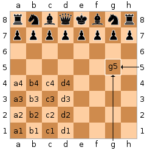

Accept two parameters:
- Type of chess piece (Queen, Rook, Knight)
- Current position on a chess board (for example: d2)

Return:
- A list of all the potential board positions the given piece could advance to, with one move, from the given position, with the assumption there are no other pieces on the board.

Rules:
- You do not have to implement the solution for every piece type, but the solution must implement at least the following: Queen, Rook and Knight.
- You may not use any external/non-core libraries: use only primitives and built-ins for the chosen language.
- Please provide test coverage for your work.

Example:
- If the code is passed:  “knight, d2”
>    $ chessercise.py -piece KNIGHT -position d2
- The output should be:  “b1, f1, b3, f3,c4, e4"

Algebraic Notation Legend: 

